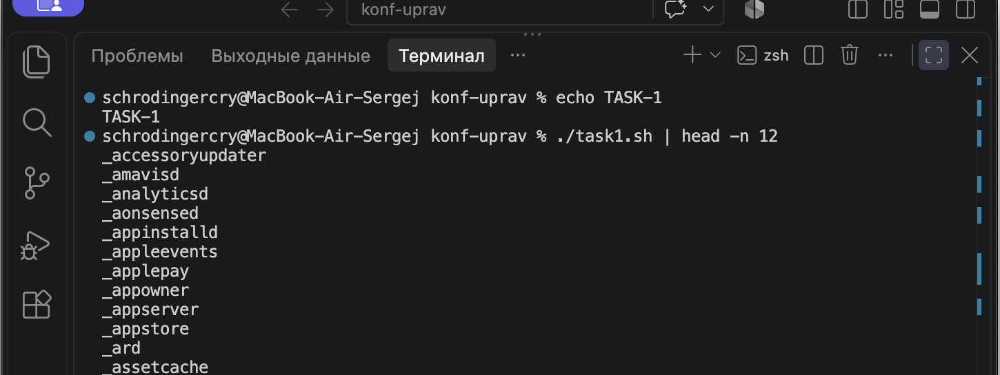
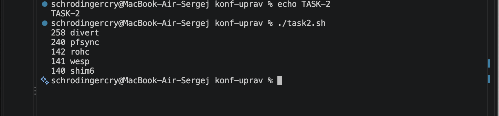
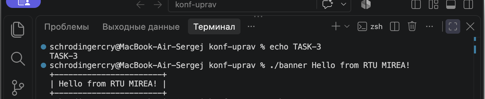
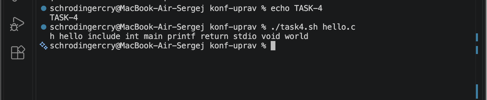
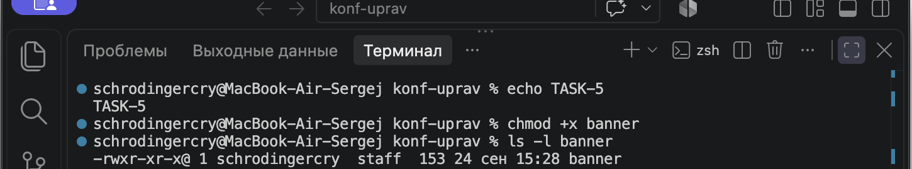
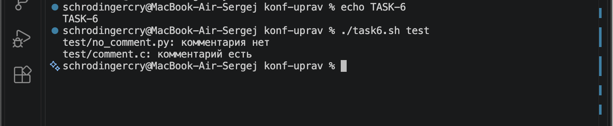
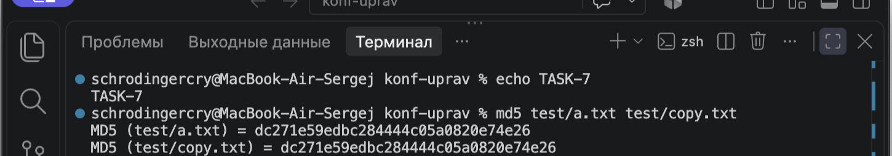
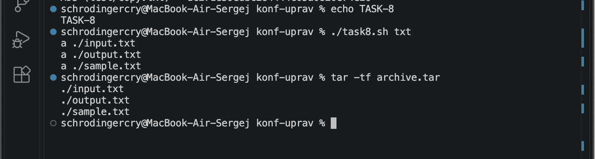
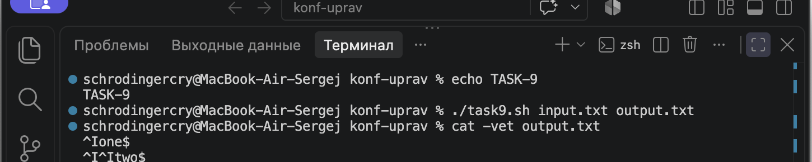
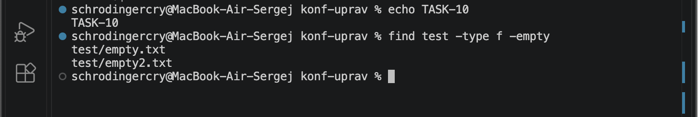

# Практическая работа №1

## Подготовка

Все программы находятся в одной папке с этим отчётом. Перед первым запуском им нужно выдать право на выполнение:

```bash
chmod +x task1.sh task2.sh banner task4.sh reg task6.sh task7.sh task8.sh task9.sh task10.sh
```

## Задача 1

**Условие.** Вывести отсортированный в алфавитном порядке список имён пользователей в файле `passwd`.

Файл `task1.sh`:

```bash
#!/bin/bash

grep -o '^[^:]*' /etc/passwd | sort
```

Запуск:

```bash
./task1.sh
```



## Задача 2

**Условие.** Вывести данные `/etc/protocols` в отформатированном и отсортированном порядке для пяти наибольших портов, как в примере задания.

Файл `task2.sh`:

```bash
#!/bin/bash

awk '!/^#/ && NF >= 2 {print $2, $1}' /etc/protocols | sort -nr | head -n 5
```

Запуск:

```bash
./task2.sh
```



## Задача 3

**Условие.** Написать программу `banner` средствами Bash для вывода текста в рамке. Размер рамки должен зависеть от длины текста.

Файл `banner`:

```bash
#!/bin/bash

text="$*"
line=$(printf '%*s' $((${#text} + 2)) '' | tr ' ' '-')

printf '+%s+\n' "$line"
printf '| %s |\n' "$text"
printf '+%s+\n' "$line"
```

Запуск:

```bash
./banner Hello from RTU MIREA!
```



## Задача 4

**Условие.** Написать программу для вывода всех идентификаторов по правилам C/C++ или Java из указанного файла без повторений.

Файл `task4.sh`:

```bash
#!/bin/bash

grep -oE '[A-Za-z_][A-Za-z0-9_]*' "$1" | sort -u | paste -sd ' ' -
```

Запуск для файла `hello.c`:

```bash
./task4.sh hello.c
```



## Задача 5

**Условие.** Написать программу `reg` для регистрации пользовательской команды: задать правильные права доступа и скопировать программу в `/usr/local/bin`.

Файл `reg`:

```bash
#!/bin/bash

chmod +x "$1"
sudo cp "$1" /usr/local/bin/
```

Запуск для программы `banner`:

```bash
./reg banner
banner "Hello!"
```

Команда `sudo` может запросить пароль пользователя Linux.



## Задача 6

**Условие.** Написать программу для проверки наличия комментария в первой строке файлов с расширениями `.c`, `.js` и `.py`.

Файл `task6.sh`:

```bash
#!/bin/bash

find "${1:-.}" -type f \( -name '*.c' -o -name '*.js' -o -name '*.py' \) -print0 |
while IFS= read -r -d '' file; do
    first_line=$(head -n 1 "$file")

    case "$file" in
        *.c|*.js) pattern='^[[:space:]]*(//|/\*)' ;;
        *.py)      pattern='^[[:space:]]*#' ;;
    esac

    if [[ $first_line =~ $pattern ]]; then
        echo "$file: комментарий есть"
    else
        echo "$file: комментария нет"
    fi
done
```

Запуск для текущего каталога:

```bash
./task6.sh .
```



## Задача 7

**Условие.** Написать программу для нахождения файлов-дубликатов по заданному пути и во всех его подкаталогах.

Файл `task7.sh`:

```bash
#!/bin/bash

find "$1" -type f -exec md5sum {} + | sort | uniq -w 32 --all-repeated=separate
```

Запуск для каталога `test`:

```bash
./task7.sh test
```

В результате выводятся только группы файлов с одинаковым содержимым.



## Задача 8

**Условие.** Написать программу, которая находит в текущем каталоге все файлы с расширением, указанным как аргумент, и архивирует их в архив `tar`.

Файл `task8.sh`:

```bash
#!/bin/bash

find . -maxdepth 1 -type f -name "*.$1" -print0 | tar --null -cvf archive.tar -T -
```

Запуск для файлов с расширением `.txt`:

```bash
./task8.sh txt
tar -tf archive.tar
```



## Задача 9

**Условие.** Написать программу, которая заменяет в файле последовательности из четырёх пробелов на символ табуляции. Входной и выходной файлы задаются аргументами.

Файл `task9.sh`:

```bash
#!/bin/bash

sed $'s/    /\t/g' "$1" > "$2"
```

Запуск:

```bash
./task9.sh input.txt output.txt
```



## Задача 10

**Условие.** Написать программу, которая выводит названия всех пустых текстовых файлов в указанной директории. Директория передаётся параметром.

Файл `task10.sh`:

```bash
#!/bin/bash

find "$1" -maxdepth 1 -type f -name '*.txt' -empty -printf '%f\n'
```

Запуск для каталога `test`:

```bash
./task10.sh test
```


